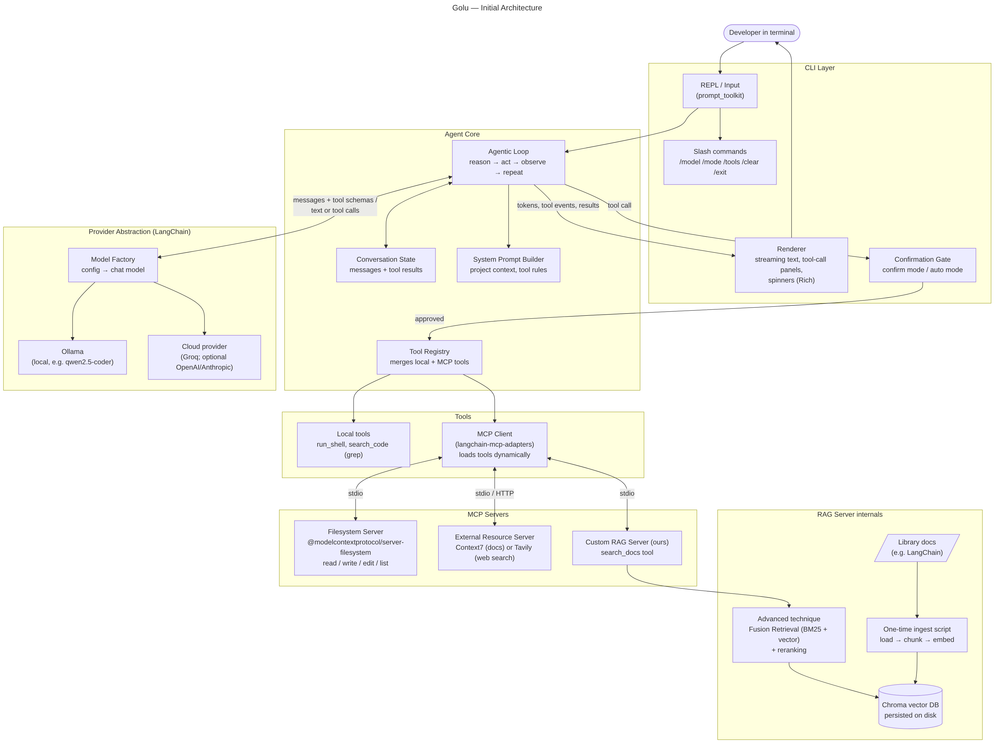
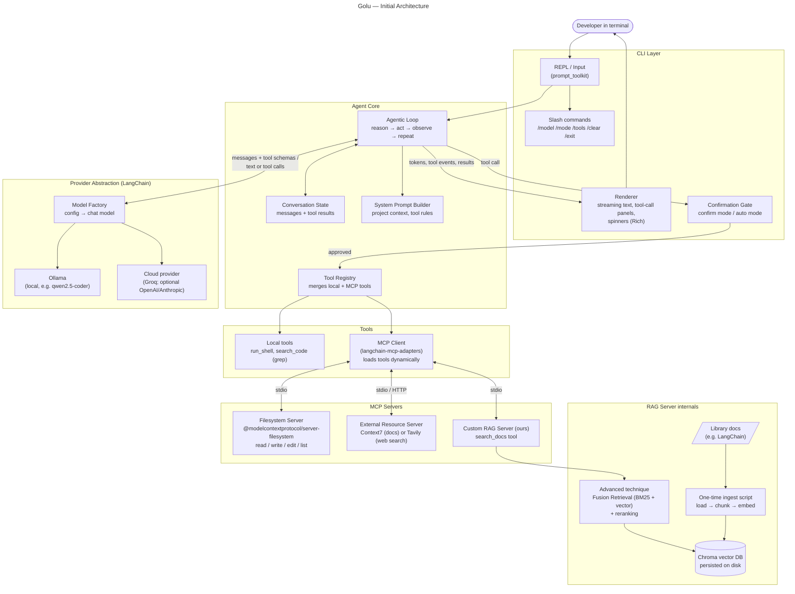
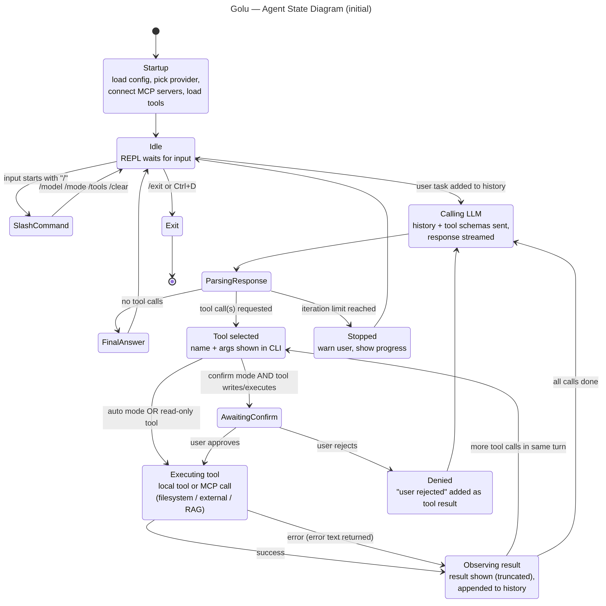
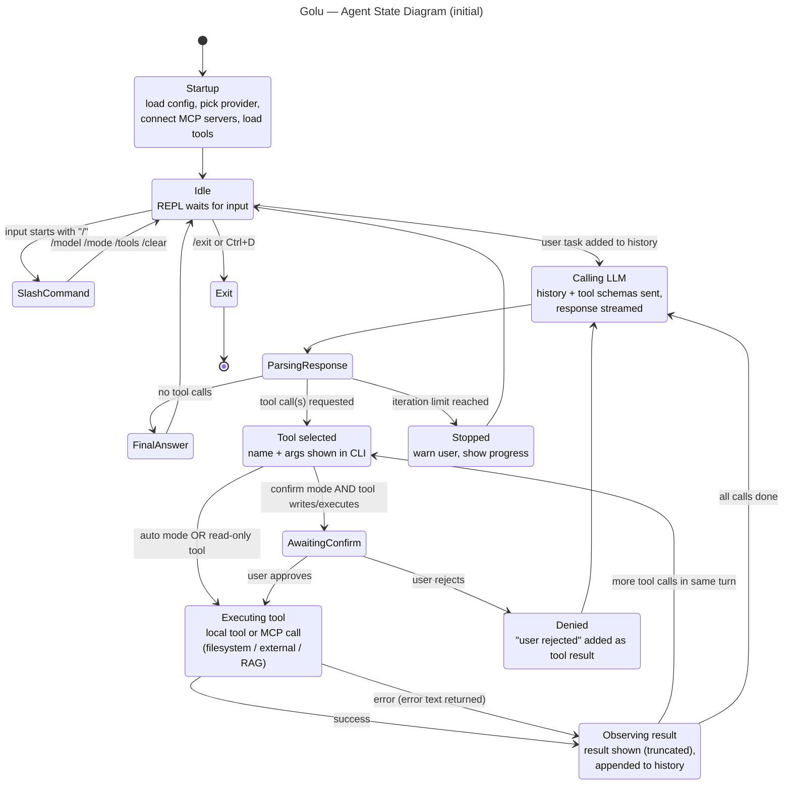
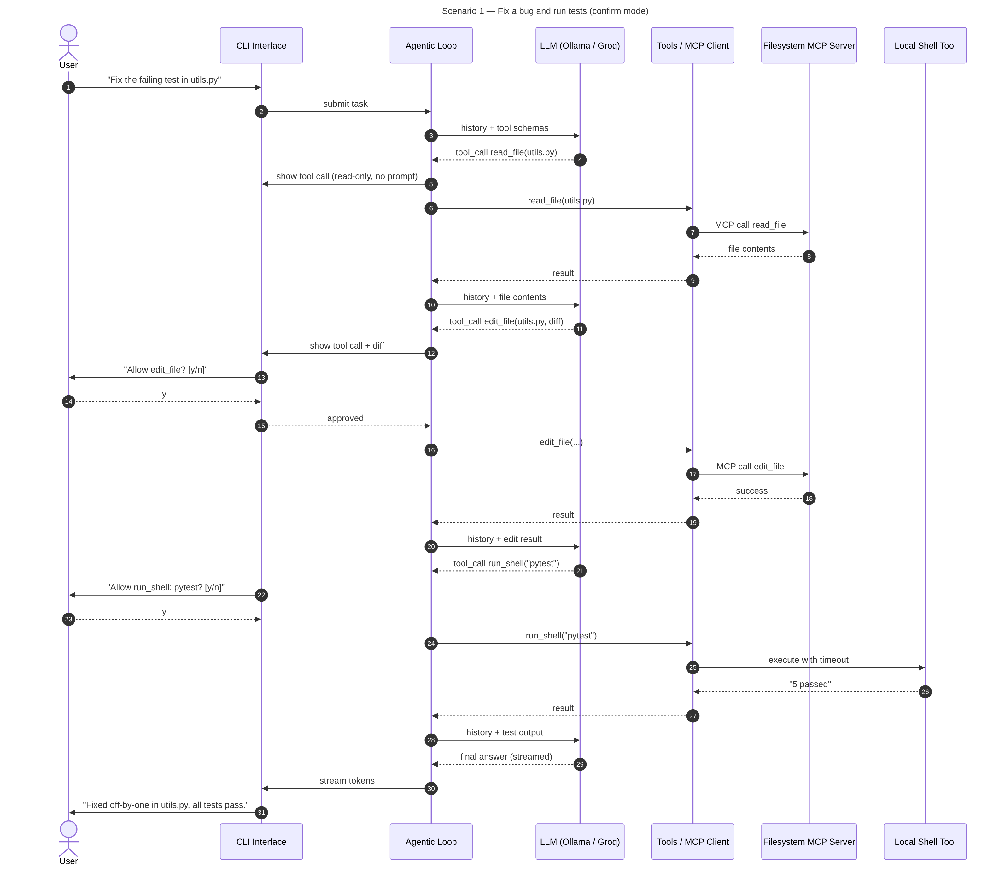
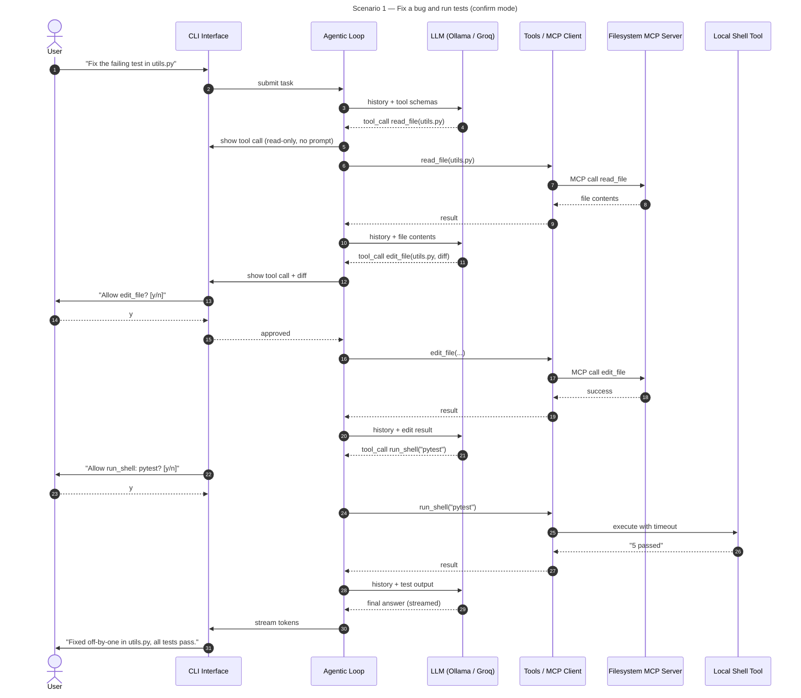
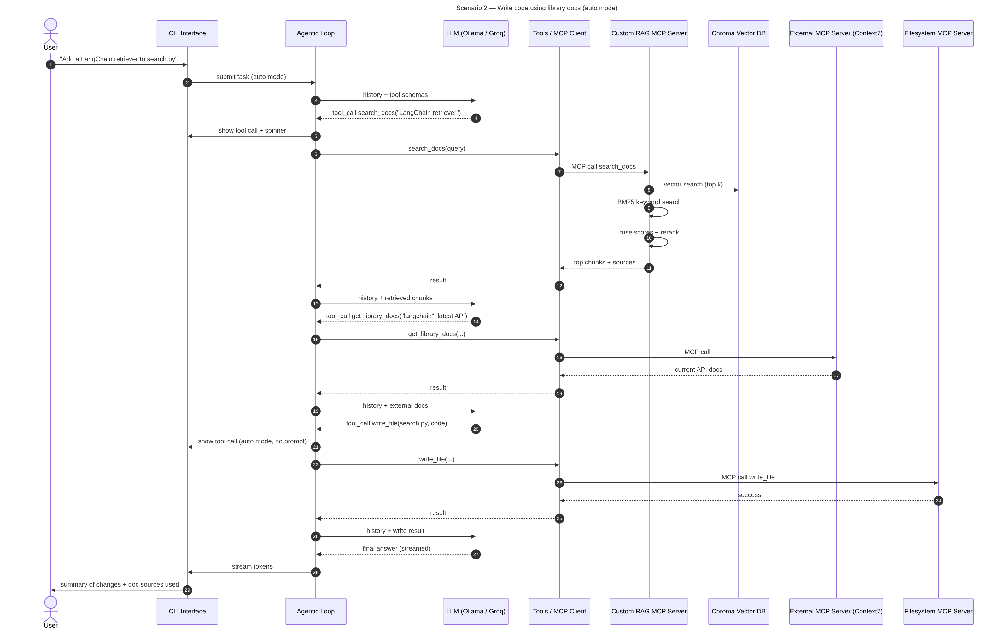
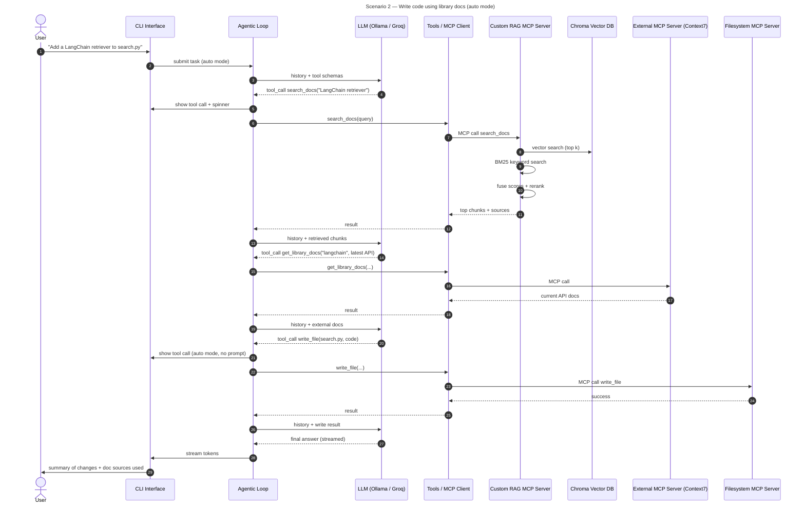

# Initial Architecture — Golu

> **Status:** Initial design (planning phase). This will change during development; any changes will be documented in the final report alongside this original version.

## Overview

Golu is a command-line AI coding assistant. The user types a natural-language task, and an agentic loop repeatedly asks an LLM what to do next, executes the tools it chooses (local tools and MCP server tools), feeds the results back, and stops when the model returns a final answer.

## Architecture Diagram

## Workflow Diagrams (initial drafts)

Drafts of the state and sequence diagrams required for the final submission. They will be revised as the implementation takes shape. The two scenarios cover four distinct end-to-end operations: reading and editing a file, running a shell command, retrieving from our RAG server, and fetching external docs.

### State diagram — agentic loop

Mermaid source

### Sequence diagram — Scenario 1: fix a bug and run tests (confirm mode)

Shows filesystem MCP read/edit, confirmation prompts, and local shell execution.

Mermaid source

### Sequence diagram — Scenario 2: write code using library docs (auto mode)

Shows the custom RAG server (fusion retrieval + rerank), the external MCP server, and a file write without confirmation.

Mermaid source

## Components

| Component | Responsibility | Planned tech |
|---|---|---|
| **CLI / REPL** | Read user tasks, slash commands, show streamed output, tool-call panels and status spinners, branding/banner | Python, `rich`, `prompt_toolkit` |
| **Confirmation gate** | In *confirm* mode, ask before any tool that writes files or runs commands; in *auto* mode, execute directly. Read-only tools never prompt | Part of CLI layer |
| **Agentic loop** | Send history + tool schemas to LLM; if response has tool calls, execute them and append results; loop until a final answer or a max-iteration limit | Python, LangChain message types |
| **Conversation state** | Holds the message list for the session (optional extension: save/load to disk) | In-memory list |
| **Provider abstraction** | One interface for any model; chosen by config/CLI flag (`--provider ollama --model qwen2.5-coder`) | LangChain `init_chat_model` / `ChatOllama`, `ChatGroq` |
| **Tool registry** | Combines local tools and MCP-loaded tools into one list with names, descriptions, and JSON schemas | LangChain tools |
| **Local tools** | `run_shell` (with timeout and output limit), `search_code` (ripgrep/grep) | `subprocess` |
| **MCP client** | Starts/connects to each server from `mcp_config.json`, lists their tools at startup, routes calls | `mcp`, `langchain-mcp-adapters` |
| **Filesystem MCP server** | Read, write, edit, list files, scoped to the project directory | `@modelcontextprotocol/server-filesystem` (npx) |
| **External MCP server** | Up-to-date library docs or web search | Context7 (or Tavily) |
| **Custom RAG MCP server** | Exposes `search_docs(query)`; returns top chunks with sources | Python `mcp` SDK (FastMCP) |
| **Ingest pipeline** | Run once: load docs → split into chunks → embed → persist | LangChain loaders/splitters, `nomic-embed-text` via Ollama, Chroma |
| **Advanced RAG technique** | Fusion retrieval: combine BM25 keyword scores and vector similarity, then rerank top results | From NirDiamant/RAG_Techniques (final choice confirmed in Week 1) |

## Request Flow (summary)

1. User enters a task in the REPL.
2. The agentic loop adds it to history and calls the selected LLM with all tool schemas.
3. The LLM either answers in text (streamed to the screen) or requests one or more tool calls.
4. Each tool call is displayed; write/execute tools go through the confirmation gate.
5. The registry routes the call to a local tool or, through the MCP client, to the right server.
6. Results are shown (truncated) and appended to history.
7. Steps 2–6 repeat until the LLM gives a final answer or the iteration limit is hit.

## Key Design Decisions (initial)

- **Python + LangChain** for provider abstraction and MCP tool adapters, so switching between Ollama and a cloud model is a config change.
- **Groq as the cloud provider** because it has a free tier; OpenAI/Anthropic can be added later through the same factory.
- **Chroma persisted to disk** so the ingest script runs once and every later session just opens the existing collection.
- **Shell execution as a local tool** because the filesystem server cannot run commands; it always requires confirmation in confirm mode.
- **Iteration limit and output truncation** to keep small local models from looping or overflowing their context.

## Open Questions

- Context7 vs. Tavily for the external server (or both).
- Which library's docs to index for RAG (LangChain proposed).
- Final advanced RAG technique: Fusion Retrieval is the current pick; alternatives are Reranking alone, HyDE, or Contextual Chunk Headers.
- Which Ollama model handles tool calling reliably enough on team laptops.
